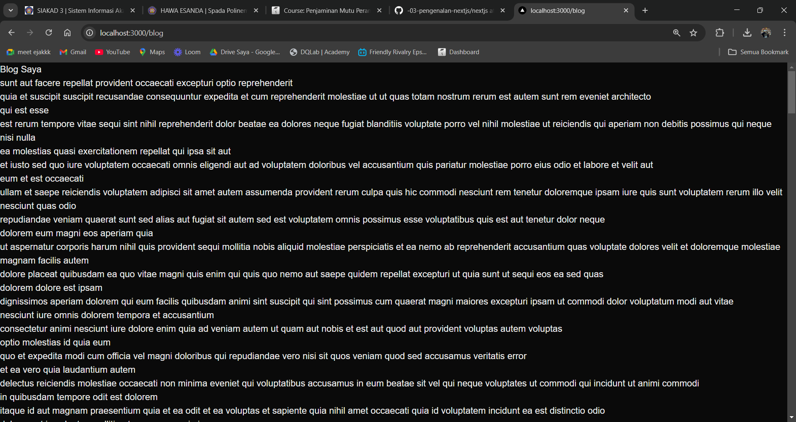
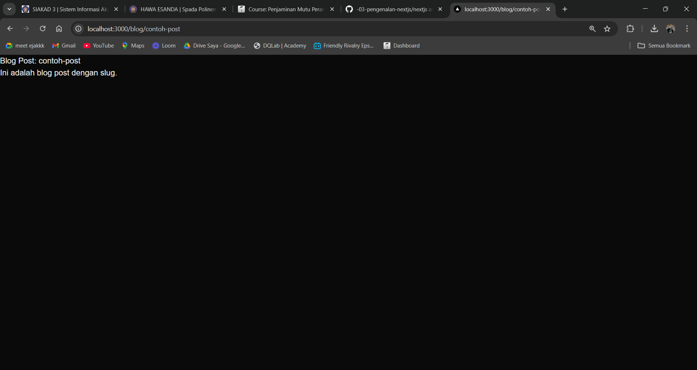
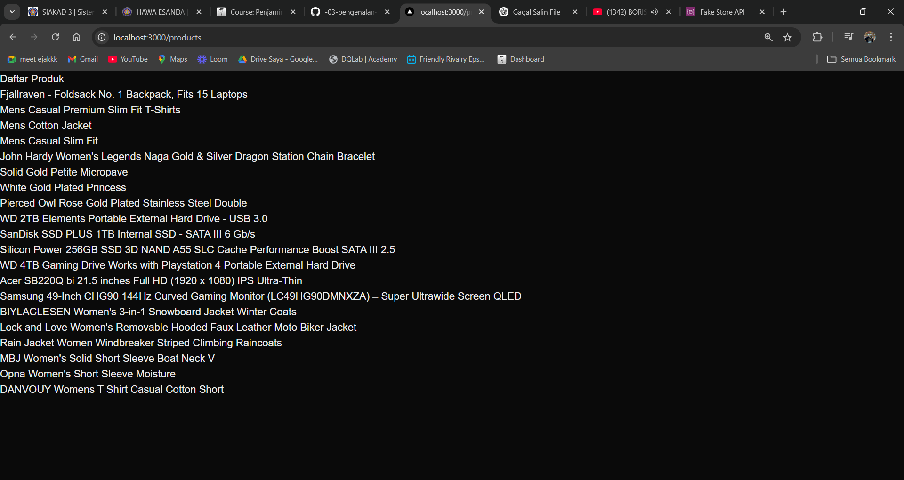

| | Pemrograman Berbasis Framework 2025 |
| --- | --- |
| NIM | 2241720079 |
| Nama | Hawa Esanda |
| Kelas | TI - 3E |

1. Membuat Halaman dengan Server-Side Rendering (SSR)

2. Menggunakan Static-State Generation

3. Menggunakan Dynamic Routes

4. Menggunakan API Routes

5. Menggunakan Link Component

Tugas
1. Buat halaman baru dengan menggunakan Static Site Generation (SSG yang menampilkan daftar pengguna dari API https://jsonplaceholder.typicode.com/users.

2. Implementasikan Dynamic Routes untuk menampilkan detail pengguna berdasarkan ID.

3. Buat API route yang mengembalikan data cuaca dari API eksternal (misalnya, OpenWeatherMap) dan tampilkan data tersebut di halaman front-end.